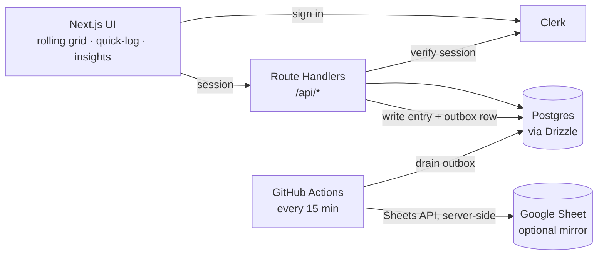

# TimeJournal

Know where your time actually goes. TimeJournal is a mobile-first web app for
fine-grained time tracking: each day is a grid of **96 fifteen-minute slots**
that you paint with your own two-level category system, then explore in
dashboards that turn a week of quarter-hours into a picture you can read at a
glance.

**Live demo:** [time-journal-pro.vercel.app](https://time-journal-pro.vercel.app)

<p>
  
  
  
  
  
  
</p>

---

## Why

Stopwatch-style trackers make you press start and stop at the exact moment life
happens — miss the moment and the data is gone. TimeJournal takes the opposite
approach. Your day is already laid out as a grid of quarter-hour slots; you just
colour them in — right now, at the end of the day, or by typing
`9-11 studying` after the fact. It's low-friction enough to become a daily
habit and structured enough to actually analyse.

Because every slot is a real database row keyed by day and position, there are
no typos silently becoming new categories, no lost history, and no formula
gymnastics. The mental model stays simple; the data underneath stays clean.

## Features

**Logging**
- A rolling **last-24-hours** grid that ends at the current hour and spans midnight — open the app and you're ready to log, no navigation. Pin any past day from the calendar and jump back with one tap.
- **Tap or drag** to paint slots. A remembered **brush** (your last-used category) turns repeat logging into a single tap.
- A **cascading picker** (main category → subcategory) from a center button on mobile, or a **persistent palette + keyboard entry** on desktop — type a code, arrow the cursor, and hold shift to batch-fill a range.
- **Per-slot notes**, multi-level **undo/redo** (`Cmd/Ctrl+Z` / `Shift+Z`), and an eraser.
- Edits apply instantly and queue locally; commit a whole session to the database in one batch with the **Upload** button (or it syncs automatically on reconnect).

**Quick-log**
- A global **⌘K / Ctrl+K** command opens a free-text box: `9-11 studying`, `930-11 Fb`, `lunch 1-1:30pm`. It parses the time range and matches a category, then shows a **confirmation preview** — always asking, never guessing, when the AM/PM or the category is ambiguous.

**Analysis**
- An **Insights dashboard** across day / week / month / year, grouped by category, parent, or colour, with a donut, a ranked breakdown, and "% of the period logged."
- **Saved-query tiles** — define custom groupings ("Outdoors = several categories") once and see their totals for any period.
- A **calendar** with per-day density so you can navigate your history visually.

**Data & sync**
- **Offline-first**: writes persist in IndexedDB, update the UI optimistically, and replay idempotently on reconnect — logging never blocks on the network.
- **Last-write-wins** across devices, with any conflicting slots flagged rather than silently overwritten.
- **CSV export** of your data, and a validated **spreadsheet importer** (`.xlsx`) to seed an account in one shot.
- Optional **one-way Google Sheets mirror**: a background worker keeps a sheet in sync as a read-only view of your data.

**Accounts**
- **Invite-only** sign-in with Google, passkeys, or email; timezone detected automatically.
- A **category editor** for your two-level taxonomy: add, rename, recolour, reorder, re-parent, and archive — codes are never hard-deleted, so history is always preserved.

## Screenshots

> Add images to `docs/screenshots/` (journal, insights, category editor) — or try the [live demo](https://time-journal-pro.vercel.app).

## Tech stack

| Layer | Choice |
|---|---|
| Framework | Next.js 16 (App Router), TypeScript, Tailwind CSS v4 |
| Client state | TanStack Query + a durable IndexedDB write queue |
| Backend | Next.js Route Handlers (`/api/*`) — a modular monolith |
| Database | Postgres on Supabase, [Drizzle ORM](https://orm.drizzle.team) |
| Auth | [Clerk](https://clerk.com) — Google, passkeys, email; invite-only via Clerk's allowlist |
| Sheets export | Outbox table + GitHub Actions cron → Google Sheets API |
| Testing / CI | Vitest + GitHub Actions (typecheck · lint · test) |

## Architecture



Key decisions:
- **Slot rows, not time ranges** — `time_entries` is keyed on `(user_id, day, slot 0–95)`, mirroring the grid one-to-one. Writes become idempotent upserts and analytics becomes a `GROUP BY`.
- **Clerk for auth, Supabase for data** — the browser authenticates with Clerk; every API route verifies the Clerk session and scopes each query to that user. Supabase is purely the Postgres database. A Clerk user maps to an internal `users` row via `clerk_id`, linked by email on first sign-in.
- **Eventually-consistent export** — each write enqueues a `(user, day)` outbox row; a cron worker rewrites just that sheet row server-side, so the optional mirror lags reality by at most the cron interval.

## Getting started

Requires Node 20+ (22+ recommended) and a free Supabase project.

**1. Install**

```bash
npm install
```

**2. Configure** — copy `.env.example` to `.env.local` and fill in:

| Variable | Where |
|---|---|
| `NEXT_PUBLIC_CLERK_PUBLISHABLE_KEY`, `CLERK_SECRET_KEY` | [Clerk Dashboard](https://dashboard.clerk.com) → API keys |
| `NEXT_PUBLIC_CLERK_SIGN_IN_URL=/sign-in` + the fallback redirect vars | as in `.env.example` |
| `DATABASE_URL` | Supabase → Connect → **Transaction pooler** (port 6543); the app connects with `prepare: false` |
| `MIGRATE_DATABASE_URL` | Supabase → Connect → **Session pooler** (port 5432); used only by `db:migrate` |
| `GOOGLE_SERVICE_ACCOUNT_KEY` | Google Cloud service-account JSON (Sheets scope), one line — optional, only for the sheet mirror |
| `CRON_SECRET` | any random string, e.g. `openssl rand -hex 32` |

**3. Set up Clerk** — in the Clerk Dashboard: enable **Google** and **Passkeys**
under User & Authentication, and turn on invite-only under **Restrictions →
Allowlist** (add the emails allowed to sign up). The sign-in URL is already
pointed at `/sign-in` via env.

**4. Migrate** — run the base schema, then the Clerk migration:

```bash
npm run db:migrate
```

Then run [`drizzle/0003_clerk_auth.sql`](drizzle/0003_clerk_auth.sql) once in the
Supabase SQL editor (it wires `users` to Clerk via `clerk_id`). Verify DB
connectivity any time with `npm run db:check`.

**5. Run**

```bash
npm run dev
```

Sign in via Clerk (Google / passkey / email). On first sign-in your account is
linked to an internal profile by email.

## Seeding from a spreadsheet

TimeJournal ships a tested importer that reads a `.xlsx` with `Categories` and
`Days` tabs: it builds the category tree, imports every logged slot, and
validates each code's count against the sheet's own totals — refusing to write
if a code is reused across two categories, and listing unknown codes rather than
inventing them.

- **In-app (recommended):** upload the file in **Settings → Import**.
- **CLI:** `npm run import:xlsx -- "/path/to/data.xlsx" <your-user-id>`

## Google Sheets mirror (optional)

`PUT /api/entries` enqueues a `sheet_outbox` row per touched day.
`POST /api/export/drain` (guarded by `CRON_SECRET`, called every 15 min by
[`.github/workflows/export-drain.yml`](.github/workflows/export-drain.yml)) drains
all pending rows server-side; `POST /api/export/sheet` does the same for just the
calling user (the "Export now" button). Set repo secrets `APP_URL` and
`CRON_SECRET` to enable the workflow, or skip it entirely if you don't want a mirror.

## Development

```bash
npm run dev          # dev server
npm run typecheck    # tsc --noEmit
npm run lint         # eslint
npm run test:run     # vitest (once) — what CI runs
npm run db:check     # verify DATABASE_URL connects
npm run db:studio    # browse the DB in Drizzle Studio
```

CI runs typecheck + lint + tests on every push/PR. The unit suite covers the pure
logic (quick-log parser, date ranges, timezone, sheet formatting,
category-cycle detection, rate limiter); DB integration tests self-skip unless a
test database is configured.

## Security

- Secrets (`CLERK_SECRET_KEY`, `GOOGLE_SERVICE_ACCOUNT_KEY`) are server-only and never reach the browser; `.env*` is gitignored.
- Sign-in is **invite-only**, enforced by Clerk's allowlist.
- Auth is fully delegated to Clerk (Google, passkeys, email); every API route verifies the Clerk session and scopes queries to the authenticated user.

## Roadmap

- [ ] Streaks and trends on Insights
- [ ] PWA install / offline service worker
- [ ] Comparative dashboards between users (opt-in)
- [ ] Bulk actions ("copy yesterday", "fill remaining as sleep")
