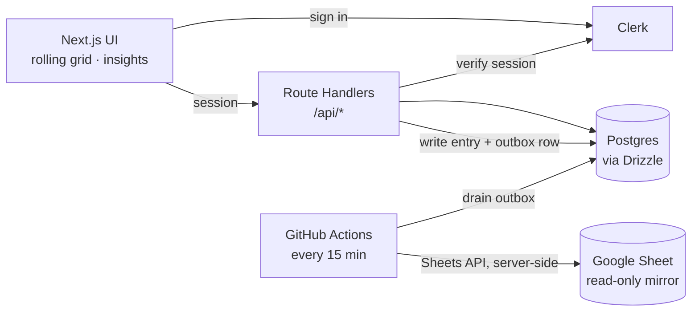

# TimeJournal

Log your life in 15-minute blocks. TimeJournal is a mobile-first web app for
fine-grained time tracking — a rolling 24-hour grid of 96 quarter-hour slots you
paint with a personal, two-level category taxonomy, plus dashboards to see where
your time actually goes.

**Live demo:** [time-journal-xi.vercel.app](https://time-journal-xi.vercel.app)

<p>
  
  
  
  
  
  
</p>

---

## Why

Time was originally logged in a Google Sheet — one row per day, 96 columns of
category codes, `COUNTIF` formulas for totals. It worked, but a spreadsheet has
no integrity (a typo silently becomes a new category), no history, clunky input,
and — in the old app — a service-account key sitting in the browser.

TimeJournal keeps the familiar 15-minute-slot mental model but moves the source
of truth to a real database, adds a fast touch-first input UI and proper
analytics, and keeps the old Google Sheet working as a one-way, read-only
mirror so nothing is lost.

## Features

**Logging**
- Rolling **last-24-hours** grid ending at the current hour (spans midnight), or pin any past day.
- **Tap or drag** to paint slots; a remembered "brush" (last-used category) makes repeat logging one tap.
- **Cascading category picker** — main categories → subcategories — from a center-bottom button on mobile, or a persistent side palette on desktop.
- **Keyboard entry** on desktop: arrow-key cursor, type a code + Enter to fill, shift-select ranges.
- **Per-slot notes**, **undo/redo** (multi-level, `Cmd/Ctrl+Z` / `Shift+Z`), and an **eraser**.

**Analysis**
- **Insights dashboard** — day / week / month / year, grouped by category, parent, or colour; donut + ranked breakdown + "% of period logged."
- **Calendar** with a per-day density indicator to jump around your history.

**Data & sync**
- **Offline-first**: writes queue in IndexedDB, update the UI optimistically, and replay idempotently on reconnect — logging never blocks on the network.
- **Last-write-wins** across devices, with conflicting slots flagged (never silently lost).
- **One-way Google Sheets mirror** via an outbox table drained by a scheduled worker.
- **CSV export** of your data; **one-time importer** for the legacy sheet.

**Accounts**
- **Invite-only** magic-link sign-in; timezone detected automatically.
- **Category editor** for a 2-level taxonomy: add, rename, recolour, reorder, re-parent, archive (never hard-delete history).

## Screenshots

> Add images to `docs/screenshots/` (journal, insights, category editor) — or try the [live demo](https://time-journal-xi.vercel.app).

## Tech stack

| Layer | Choice |
|---|---|
| Framework | Next.js 16 (App Router), TypeScript, Tailwind CSS v4 |
| Data layer | TanStack Query + a durable IndexedDB write queue |
| Backend | Next.js Route Handlers (`/api/*`) — a modular monolith |
| Database | Postgres on Supabase, [Drizzle ORM](https://orm.drizzle.team) |
| Auth | [Clerk](https://clerk.com) — Google, passkeys, email; invite-only via Clerk's allowlist |
| Sheets export | Outbox table + GitHub Actions cron → Google Sheets API |
| Testing / CI | Vitest + GitHub Actions (typecheck · lint · test) |

## Architecture



Key decisions:
- **Slot rows, not time ranges** — `time_entries` is keyed on `(user_id, day, slot 0–95)`, mirroring the grid, making writes idempotent upserts and analytics a `GROUP BY`.
- **Clerk for auth, Supabase for data** — the browser authenticates with Clerk; the API verifies the Clerk session and scopes every query to the user. Supabase is purely the Postgres database. A Clerk user id maps to an internal `users` row (by `clerk_id`, linked by email on first sign-in).
- **Eventually-consistent export** — each write enqueues a `(user, day)` outbox row; a cron worker rewrites just that sheet row server-side, so the sheet lags reality by at most the cron interval.

## Getting started

Requires Node 20+ (22+ recommended) and a free Supabase project.

**1. Install**

```bash
npm install
```

**2. Configure** — copy `.env.example` to `.env.local` and fill in:

| Variable | Where |
|---|---|
| `NEXT_PUBLIC_CLERK_PUBLISHABLE_KEY`, `CLERK_SECRET_KEY` | [Clerk Dashboard](https://dashboard.clerk.com) → API keys |
| `NEXT_PUBLIC_CLERK_SIGN_IN_URL=/sign-in` + the fallback redirect vars | as in `.env.example` |
| `DATABASE_URL` | Supabase → Connect → **Transaction pooler** (port 6543); the app connects with `prepare: false` |
| `MIGRATE_DATABASE_URL` | Supabase → Connect → **Session pooler** (port 5432); used only by `db:migrate` |
| `GOOGLE_SERVICE_ACCOUNT_KEY` | Google Cloud service-account JSON (Sheets scope), one line — optional, only for sheet export |
| `CRON_SECRET` | any random string, e.g. `openssl rand -hex 32` |

**3. Set up Clerk** — in the Clerk Dashboard: enable **Google** and **Passkeys**
under User & Authentication, and turn on invite-only under **Restrictions →
Allowlist** (add the emails allowed to sign up). Point the sign-in URL at
`/sign-in` (already configured via env).

**4. Migrate** — run the base schema, then the Clerk migration:

```bash
npm run db:migrate
```

Then run [`drizzle/0003_clerk_auth.sql`](drizzle/0003_clerk_auth.sql) once in the
Supabase SQL editor (it decouples `users` from Supabase Auth and adds `clerk_id`).
Verify DB connectivity any time with `npm run db:check`.

**5. Run**

```bash
npm run dev
```

Sign in via Clerk (Google / passkey / email). On first sign-in your Clerk account
links to an internal profile (by email, so any pre-existing data stays yours).

## Importing an existing sheet

Two ways — both use the same tested importer, which reads the `Categories` and
`Days` tabs, builds the category tree, imports every logged slot, and validates
each code's count against the sheet's own totals (refusing to write if a code is
reused across two categories, and listing rather than inventing unknown codes):

- **In-app (recommended):** in Google Sheets, `File → Download → Microsoft Excel (.xlsx)`, then upload it in **Settings → Import from Google Sheet**.
- **CLI:** `npm run import:xlsx -- "/path/to/exported.xlsx" <your-user-id>`

## Sheets export

`PUT /api/entries` enqueues a `sheet_outbox` row per touched day.
`POST /api/export/drain` (guarded by `CRON_SECRET`, called every 15 min by
[`.github/workflows/export-drain.yml`](.github/workflows/export-drain.yml)) drains
all pending rows server-side; `POST /api/export/sheet` does the same for just the
calling user (the "Export now" button). Set repo secrets `APP_URL` and
`CRON_SECRET` to enable the workflow.

## Development

```bash
npm run dev          # dev server
npm run typecheck    # tsc --noEmit
npm run lint         # eslint
npm run test:run     # vitest (once) — what CI runs
npm run db:check     # verify DATABASE_URL connects
npm run db:studio    # browse the DB in Drizzle Studio
```

CI runs typecheck + lint + tests on every push/PR. The unit suite covers the pure
logic (quick-log parser, date ranges, timezone, sheet formatting,
category-cycle detection, rate limiter); DB integration tests self-skip unless a
test database is configured.

## Security

- Secrets (`CLERK_SECRET_KEY`, `GOOGLE_SERVICE_ACCOUNT_KEY`) are server-only and never reach the browser; `.env*` is gitignored.
- Sign-in is **invite-only**, enforced by Clerk's allowlist.
- Auth is fully delegated to Clerk (Google, passkeys, email); the API verifies the Clerk session and scopes every query to the authenticated user.

## Roadmap

- [ ] Quick-log free-text UI (the parser API already exists)
- [ ] Saved-query tiles and streaks on Insights
- [ ] PWA install / service worker
- [ ] Comparative dashboards between users (opt-in)

